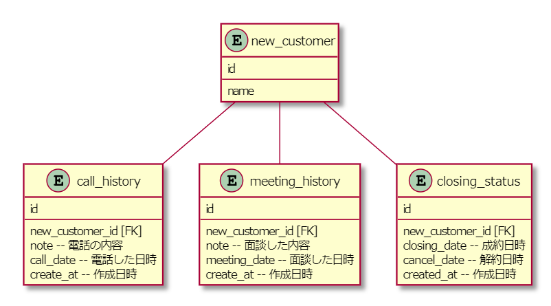
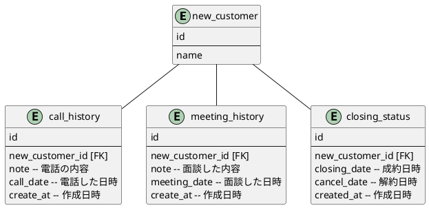

# 課題1
- 問題のテーブルでは「面談をした日付」や「電話の内容メモ」など、複数回発生するようなデータをカラムとして管理している。  
そのため、複数のデータが必要な場合でも一つしか登録できず、問題が生じる。
- 電話の内容や面談など、新規顧客とは切り離せる概念が新規顧客テーブルに集まっている。そのため、テーブルが肥大化しメンテナンスが大変になる。

# 課題2
- 以下のような別々の概念は分けてテーブルを作成する
    - 電話
    - 面談
    - 制約

# 課題3
- 顧客管理システムで顧客の既婚/未婚の情報を管理するとする。複数回結婚した場合の履歴が残せず、今回のアンチパターンに陥る。