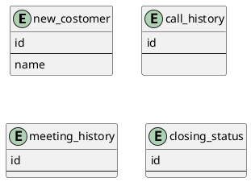

# 課題1
- 問題のテーブルでは「面談をした日付」や「電話の内容メモ」など、複数回発生するようなデータをカラムとして管理している。  
そのため、複数のデータが必要な場合でも一つしか登録できず、問題が生じる。
- 電話の内容や面談など、顧客とは異なる概念が顧客テーブルに集まっているので、拡張性に問題がある。

# 課題2
- 以下のような別々の概念は分けてテーブルを作成する
    - 電話
    - 面談
    - 制約

# 課題3
- 