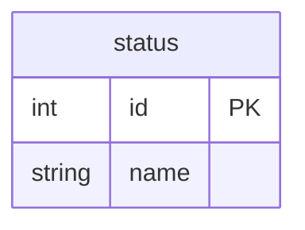
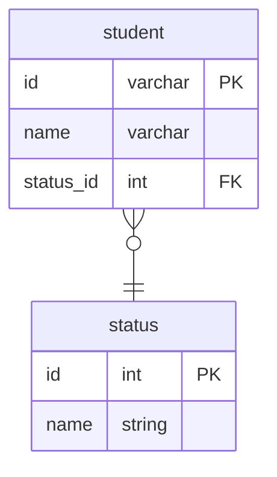

# 課題1
- ステータスのような、カラムに入れる値を限定したい場合

## 方法1 Check制約
- Chech制約を使い値を指定することで、カラムに入れる値を限定できる
- status: varchar CHECK(status IN ("studying","graduated","suspended"))

### メリット
- 制約を設けるだけで値を限定できる 

### デメリット
- 値を変更する時が大変
    - check制約の値を変更・削除する場合、一度制約を削除して作り直さなければならない。
    - 同時に既存のデータの更新・削除もあるので、順序を考慮してクエリを実行する必要あり。

### SQLはquery_before.sqlを参照

## 方法2 ステータスを別テーブルで管理
- statusテーブルを作り、値を管理する
- 他のテーブルはこのstatusテーブルのidを外部参照する

### メリット
- 値の変更が簡単
    - statusテーブルの値を変更すれば良いだけ
### デメリット
- statusを検索する時はjoinが必要
    - 多対１なので検索のコストは低いため実際はデメリットにはならない

### SQLはquery_after.sqlを参照

# 課題2

# 課題3
- 自動販売機を管理するシステム。稼働中、停止中、故障中のステータスを持たせようとして今回のアンチパターンに陥る。