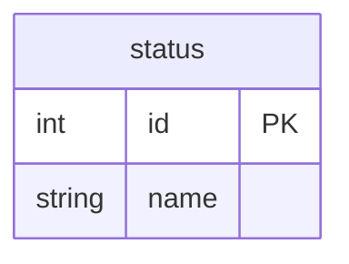
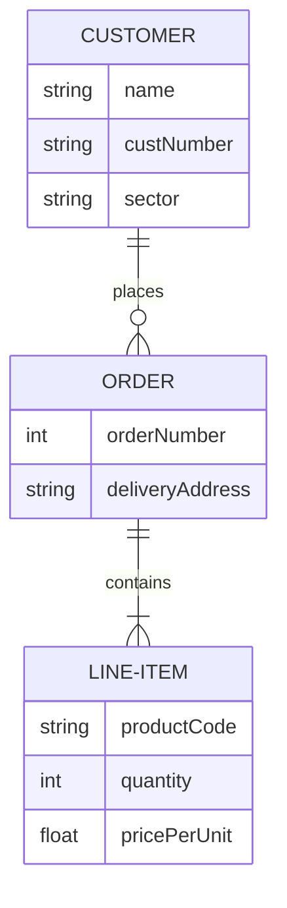

# 課題1
- ステータスのような、カラムに入れる値を限定する

## 方法1 Check制約
- Chech制約を使い値を指定することで、カラムに入れる値を限定できる
- status: varchar CHECK(status IN ("studying","graduated","suspended"))

### メリット
- 制約を設けるだけで値を限定できる 

### デメリット
- 値を変更する時が大変
    - Check制約で指定した値を変更する場合、該当するレコードをすべて更新する必要がある

## 方法2 ステータスを別テーブルで管理
- statusテーブルを作り、値を管理する
- 他のテーブルはこのstatusテーブルのidを外部参照する

### メリット
- 値の変更が簡単
    - statusテーブルの値を変更すれば良いだけ
### デメリット
- statusテーブルとjoinが必要
    - statusを検索する場合はstatusテーブルをjoinする必要がある
    - 多対１なので検索のコストは低いため実際はデメリットにはならない
# 課題2

# 課題3