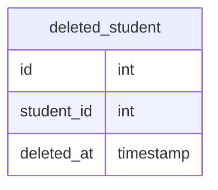
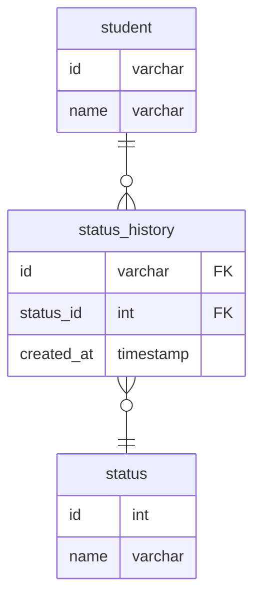
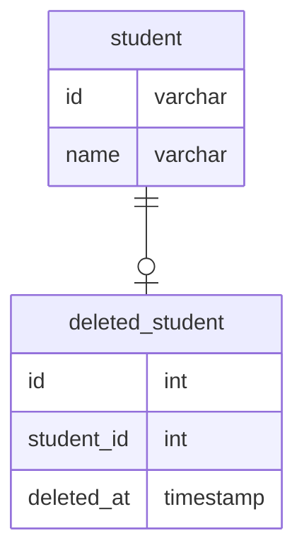

# 課題1
- ユーザーが退会済みか否か判断したい

## 方法1：削除フラグ
- この課題で行っている方法
- 削除フラグを持たせて、trueなら退会済み、falseなら退会してないことを表す
### メリット
- カラムを追加するだけで対応できる
- データを復活させたい場合は削除フラグをupdateすればいいだけ
### デメリット
- テーブルselect時に削除フラグの判定が必要になる
    - Studentテーブルで有効なデータをselectする時に、削除フラグ = falseの条件を常に入れる必要がある
- 削除の種類が増えた場合に対応できない
    - 例えば、ユーザーによる削除、ユーザー管理者による削除、サービス提供側による削除など種類を設けたい場合、それができない
    - それぞれの削除に合わせてフラグを追加すると、テーブルが煩雑になる
- 退会した日時が分からない
    - これは削除テーブルを作れば対応できる

## 方法2：削除を含むステータスを持たせる
- statusカラムを追加し、0:有効、1:一時無効、2:削除済み、のようにステータスを持たせる
### メリット
- 削除以外の状態にも対応できる
    - 削除を状態の一部として持たせているので、他の状態にも対応できる
- 他は方法1と同じ
### デメリット
- 削除の種類に対応できる点を除けば、方法1と同じ
 ## 方法3：削除テーブルに移す
- 削除したデータはdeleted_studentのような削除されたデータ専用のテーブルに移す
### メリット
- select時に削除フラグを判定する必要がない
    - studentテーブルには有効なデータしか残らないので、削除フラグの判定のような対応が不要になる
### デメリット
- 削除時に削除テーブルにデータを移す処理が必要
- 削除データに関連するデータもすべて削除テーブルに移す必要があるので、運用コストが高い

# 課題2
- ユーザーが退会済みかどうか判断したいのは、退会したユーザーのデータを何らかのために残しておきたいという目的があると想定
- その場合、ユーザーデータに情報を付加することで実現できる。課題1の方法3のようにデータを別の場所に移動する方法もあるが、運用コストが高いため今回はなしとする
- studentの状態を持つstatusテーブルとその履歴を残すstatus_historyテーブルを作成。status_historyは退会日時が分かるようにするため
- 削除フラグを持たせる方法は不採用。理由は「休会中」のようなステータスが将来的に出てきた場合にそのたびにフラグ追加が必要になるため

- 削除だけを考えるなら、statusテーブルは不要で削除履歴テーブルを作成する方法でも良いと思う

# 課題3
## ECサイトのケース
- 注文取り消しの取り消しが対応できない
- 支払いのキャンセル処理で後から注文を参照したい場合、それができない
- 在庫を戻す処理で後から注文を参照したい場合、それができない
- 取り消した注文の詳細をユーザーが見れない

## 進捗管理サービス
- 削除の取り消しができない
- 後から退会した総人数を確認したい場合、それができない

## 自身の経験
物理削除を採用した経験はない（データベース設計の経験自体がない。。）