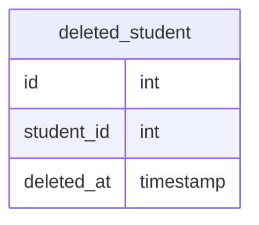
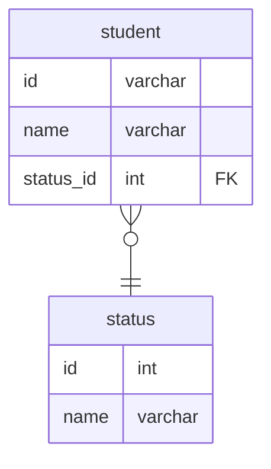
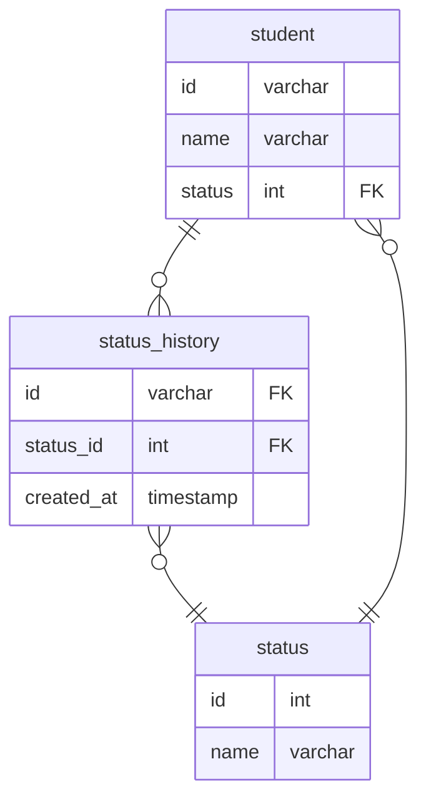
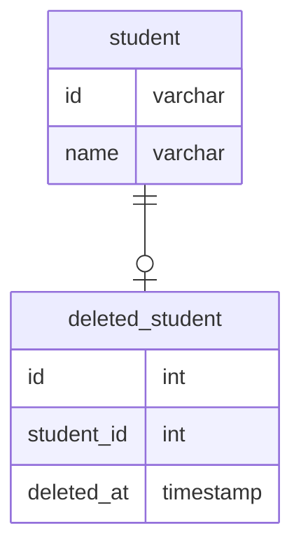

# 課題1
- 退会済みのユーザーを論理削除する

## 方法1：削除フラグ
- この課題で行っている方法
- 削除フラグを持たせて、trueなら退会済み、falseなら退会してないことを表す
### メリット
- カラムを追加するだけで対応できる
- データを復活させたい場合は削除フラグをupdateすればいいだけ
### デメリット
- テーブルselect時などに削除フラグの判定が必要になる
    - Studentテーブルで有効なデータを操作する時に、削除フラグ = falseの条件を常に入れる必要がある
- 削除の種類が増えた場合に対応できない
    - 例えば、ユーザーによる削除、ユーザー管理者による削除、サービス提供側による削除など種類を設けたい場合、それができない
    - それぞれの削除に合わせてフラグを追加すると、テーブルが煩雑になる
- 退会した日時が分からない
    - これは削除テーブルを作れば対応できる

## 方法2：ステータスを作り、その中の一つを削除にする
- statusカラムを追加し、0:有効、1:一時無効、2:削除済み、のようにステータスを持たせる
### メリット
- 削除以外のステータスにも対応できる
    - 削除を状態の一部として持たせているので、他の状態にも対応できる
- 他は方法1と同じ
### デメリット
- 複数のステータスに対応できる点を除けば、方法1と同じ
 ## 方法3：削除テーブルに移す
- 削除したデータはdeleted_studentのような削除されたデータ専用のテーブルに移す
### メリット
- select時などに削除フラグを判定する必要がない
    - studentテーブルには有効なデータしか残らないので、削除フラグの判定のような対応が不要になる
### デメリット
- 削除時に削除テーブルにデータを移す処理が必要
- 削除データに関連するデータもすべて削除テーブルに移す必要があるので、運用コストが高い

# 課題2
- ユーザーが退会済みかどうか判断したいのは、退会したユーザーのデータを何らかのために残しておきたいという目的があると想定
- その場合、ユーザーデータに情報を付加することで実現できる。方法3は運用コストが高いので避けた方がよさそう
- ミニマムなら課題の通りフラグで対応すればいいが、休会中のような別のステータスにも将来対応できるようstatusを持たせるようにする

- ユーザーから問い合わせで退会日を答えるユースケースなどありそうなので退会日時が分かると良いと思う
    - その場合は次のようにstatus_historyを設けて、ステータスの変更日時を記録する
    - ただしステータスを取得するクエリが複雑になるので、studentテーブルに現在のステータスを持たせた方がよさそう

- もし削除だけを考えるなら、statusテーブルは不要で削除履歴テーブルを作成する方法でも良いと思う
    - ただ拡張性がないので、前の方法の方が良いと思う

- いずれにせよ有効なデータを操作するときにwhere句が必要になる件は避けられなそう
# 課題3
## ECサイトのケース
- 注文取り消しの取り消しが対応できない
- 支払いのキャンセル処理で後から注文を参照したい場合、それができない
- 在庫を戻す処理で後から注文を参照したい場合、それができない
- 取り消した注文の詳細をユーザーが見れない

## 進捗管理サービス
- 削除の取り消しができない
- 後から退会した総人数を確認したい場合、それができない

## 自身の経験
物理削除を採用した経験はない（データベース設計の経験自体がない。。）