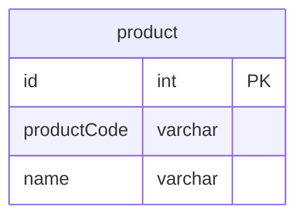

# 課題1
- 主キーを設定したい
## 方法1: 自然キー
- 課題の中で使われていてる方法
- 製品番号や社員IDのような、要求仕様に含まれている一意な情報をPKにする方法
### メリット
- 追加でIDなどを付与する必要がない
    - 要求仕様の自然な値をPKに設定すればいいだけなので、シンプル
### デメリット
- 自然キーにできる情報が存在しない場合がある
    - 要求仕様によっては一意な値を持たない場合があるので、自然キーを採用できない
- 自然キーは変わる可能性がある
    - 例えば製品品番を自然キーにしたが、将来品番を変更する可能性があるなど
    - キーが変わったらPKの更新が必要になる。PKは外部参照に使われることも多いので、修正のコストが高い
- 自然キーの値がないデータは追加できない
    - 例えば製品品番を採番する前にDBに登録したい場合など
## 方法2: 人口キー
- 要求仕様とは無関係の一意な値を採番しPKにする方法
### メリット
- 一意で不変な値を設定できる
    - UUIDなどで人工的に作り出しているので、一意で不変であることが保証される
- 数値なので、検索時など取り扱いが楽
    - 自然キーだと文字列になることも多いので、検索が遅くなりがち
### デメリット
- 値の採番が必要
    - UUIDやDBの機能でコストはかからず対応できるので、あまりデメリットではない
- 
# 課題2
- productCodeは不変で一意であることが保証できないため、人口キーを追加する
    - PKの採番はDBの機能を利用する
    http://www.code-magagine.com/?p=1406

# 課題3
- 委託で社員管理システムを作る場合。クライアントの会社には社員ごとに連番の社員番号が存在するため、これをPKに設定し、アンチパターンに陥る