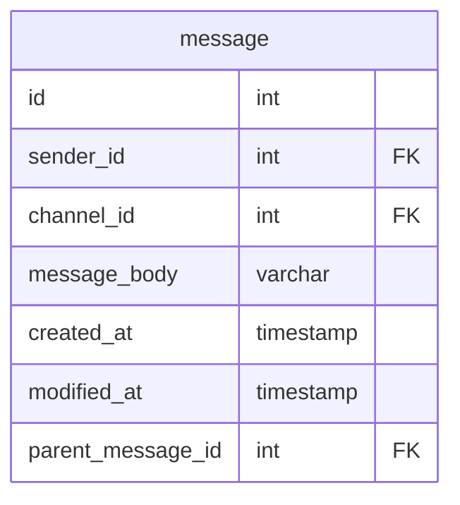
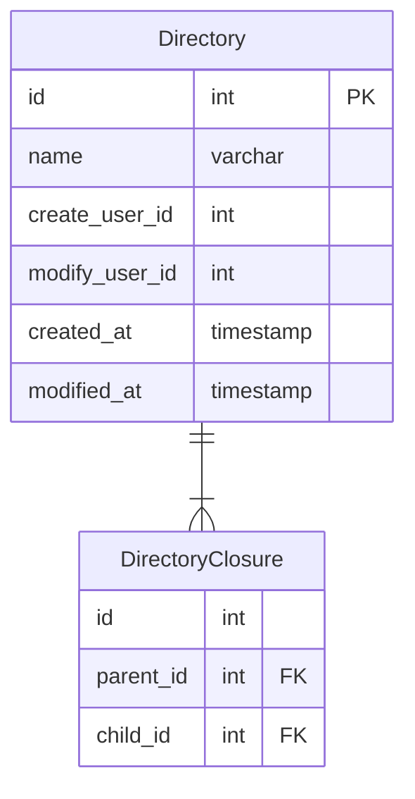
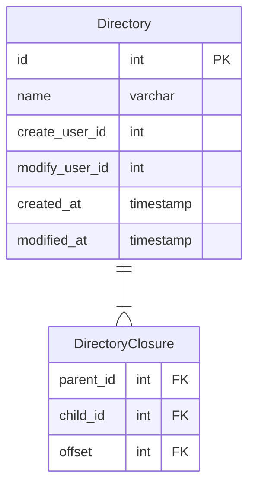

# 課題見直し

## 課題1（寿司）
特になし

## 課題2（Slack）
メッセージの親子関係を自身のテーブルを参照する形で表現している。
Slackの場合は孫の関係まで表現する必要がない（スレッドが入れ子にならない）のでこれでよい。
もし孫以上の関係も発生する場合は閉包テーブルで管理する方が良い。
### 当時の設計（関連部分のみ抜粋）

## 課題3（ドキュメント管理サービス）
ドキュメントは孫以上の親子関係が発生するので閉包テーブルを使用した方が良い。
### 当時の設計（関連部分のみ抜粋）
閉包テーブルが使われているが、ツリー構造のまま取得するにはoffsetのような親ノードとの深さを持つカラムがあった方がいい。
あと閉包テーブルのidは不要。

### 修正後

## 課題4（penpen）
特になし

## 課題5（ブログサービス）
特になし