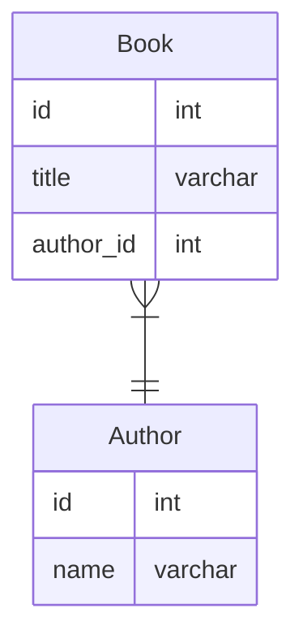

# 課題1


## 外部キー制約を定義しない場合の問題点
- 存在しない値が外部キーに登録される可能性がある
    - プログラムのバグなどで存在しない値が外部キーに入るとデータの整合性が保てなくなる
- 親テーブルを誤って削除してしまう可能性がある
    - 親テーブルが消えると、子テーブルは存在しない親のデータを参照し続けることになるので、データの整合性が保てなくなる

## 外部キー制約を定義する場合の問題点
- 親データを削除する場合は先に子データを削除する必要がある
    - 子→親と順番に削除しないとエラーになってしまうので、注意が必要

# 課題2
## MySQLで設定可能な参照アクション
- CASCADE
    - 親テーブルの行を更新・削除すると、子テーブルの一致する行を自動的に更新・削除する。ON DELETE CASCADEとON UPDATE CASCADEがある
    - 使用例：ゲームの試合テーブル（親）と参加者テーブル（子）があり、試合が終わると自動的に参加者テーブルの該当レコードを削除したい場合。
- SET NULL
    - 親テーブルの行を更新・削除すると、子テーブルの一致するカラムをnullに設定する。ON DELETE SET NULLとON UPDATE SET NULLがある
    - 使用例：部署テーブル（親）と従業員テーブル（子）があり、部署がなくなった場合、従業員の異動が間に合わな買った場合に一時的にnullをセットしたい場合。
- RESTRICT
    - 標準の設定。親テーブルの更新・削除を拒否する
    - 使用例：参照アクション不要が特に不要な場合。
- NO ACTION
    - 親テーブルの更新・削除を拒否する。SQL標準のキーワード。MySQLではRESTRICTと一緒。MySQL以外の遅延チェック機能を持つSQL（PostgreSQLなど）では、これを設定すると遅延チェック有効になる
    - 使用例：
- SET DEFAULT
    - この設定をするとテーブルを作成できない
    - 使用例：不明。

## 以下のケースでon delete cascadeがあることの問題はなにか？
```sql
-- 社員
create table Employee (
    id int primary key,
    name varchar(255),
    department_id int,
    foreign key (department_id) references Department (id) on delete cascade
);
-- 部署
create table Department (
    id int primary key,
    name varchar(255)
);
```
- on delete cascadeは参照先が削除された場合、紐づく参照元レコードを自動的に削除する
- そのため、部署を削除した場合、紐づく社員が削除されてしまう
    - 社員は部署と共に消えるわけではなく、他の部署に異動など、その後も存在し続けることが期待結果と思われるので、期待と異なるリスクがある

## 以下のケースでon delete set nullがあることの問題はなにか？
```sql
-- 案件
create table Issue (
    id int primary key,
    name varchar(255),
    assignee_id int,
    foreign key (assignee_id) references Assignee (id) on delete set null
);
-- 担当者
create table Assignee (
    id int primary key,
    name varchar(255)
);
```
- on delete set nullは参照先が削除された場合、紐付く参照元レコードの外部キーカラムをnullにする
- そのため、担当者が削除された場合に、誰にもアサインされていない案件が発生していしまう
    - 案件には必ず担当者が任命されなければいけないので、期待結果と異なるリスクがある
## Prismaのデフォルトの参照アクション
deleteの場合、外部キーカラムがnull許容の場合はSetNullがデフォルト、null許容でない場合はRestrictがデフォルトになる。
updateの場合、null許容に関わらずCascadeがデフォルトになる。
つまり、デフォルトの状態ではdeleteで参照元データが消えるということはない。

| Clause   | Optional relations	| Mandatory relations |
| -------- | ------------------ | --------------------|
| onDelete | SetNull            | Restrict |
| onUpdate | Cascade            | Cascade |
https://www.prisma.io/docs/concepts/components/prisma-schema/relations/referential-actions#referential-action-defaults


## TypeORMのデフォルトの参照アクション
deleteの場合、デフォルトの記述はドキュメントで見つからなかった。
updateの場合、デフォルトではcascadeにはならないとのこと。そのためrestrictになる可能性が考えられる。

## MySQLとPostgreSQLでのrestrictとno actionの違い
restrict
- 標準の設定。親テーブルの更新・削除を拒否する
- MySQLでもPostgreSQLでも同じ
no action
- 親テーブルの更新・削除を拒否する。SQL標準のキーワード。
- MySQLではrestrictと一緒。PostgreSQLではrestrictの制約に加え、遅延チェックが有効になるという違いがある

# 課題3
## PostgreSQLでrestrictではなくno actionを指定する場合、具体的にどんなことをしたいケースが考えられるか？
- no actionだと外部キーのチェックがクエリ実行時でなくコミット時になる。そのため、親子にデータをinsertするとき、一度親を削除して別の親に子を付け替えるときなどにクエリの実行順を気にしなくてよくなるので使用できる。
## 課題2の社員と部署のモデルの場合、updateの参照アクションは何を設定するのが良いか？
- on delete cascade on update cascadeが良さそう
    - on deleteについては、部署の削除で社員が消えるのは想定外のケースが多いと思うのでcascadeややめた方が良いと考える。そのため、restrictで親の削除を禁止するか、set nullで部署をnullにして社員が残るのが良い。どちらがいいかはケースによる。
    - on updateについては、部署のidを変更しても問題はなさそうなのでcascadeで良さそう。
```sql
-- 社員
create table Employee (
    id int primary key,
    name varchar(255),
    department_id int,
    foreign key (department_id) references Department (id) on delete restrict on update cascade
);
-- 部署
create table Department (
    id int primary key,
    name varchar(255)
);
``` 