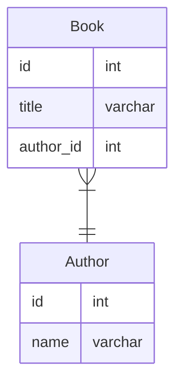

# 課題1

## 外部キー制約を定義しない場合の問題点
- 存在しない値が外部キーに登録される可能性がある
    - プログラムのバグなどで存在しない値が外部キーに入るとデータの整合性が保てなくなる
- 親テーブルを誤って削除してしまう可能性がある
    - 親テーブルが消えると、子テーブルは存在しない親のデータを参照し続けることになるので、データの整合性が保てなくなる

## 外部キー制約を定義することの問題点
- 親データを削除する場合は先に子データを削除する必要がある
    - 子→親と順番に削除しないとエラーになってしまうので、注意が必要

# 課題2
## MySQLで設定可能な参照アクション
- CASCADE
    - 親テーブルの行を更新・削除すると、子テーブルの一致する行を自動的に更新・削除する
    - ON DELETE CASCADEとON UPDATE CASCADEがある
- SET NULL
    - 親テーブルの行を更新・削除すると、子テーブルの一致するカラムをnullに設定する
    - ON DELETE SET NULLとON UPDATE SET NULLがある
- RESTRICT
    - 標準の設定。親テーブルの更新・削除を拒否する
- NO ACTION
    - 標準の設定。親テーブルの更新・削除を拒否する
    - SQL標準のキーワード
    - MySQLではRESTRICTと一緒
    - MySQL以外の遅延チェック機能を持つSQL（PostgreSQLなど）では、これを設定すると遅延チェック有効になる
- SET DEFAULT
    - この設定をするとテーブルを作成できない
