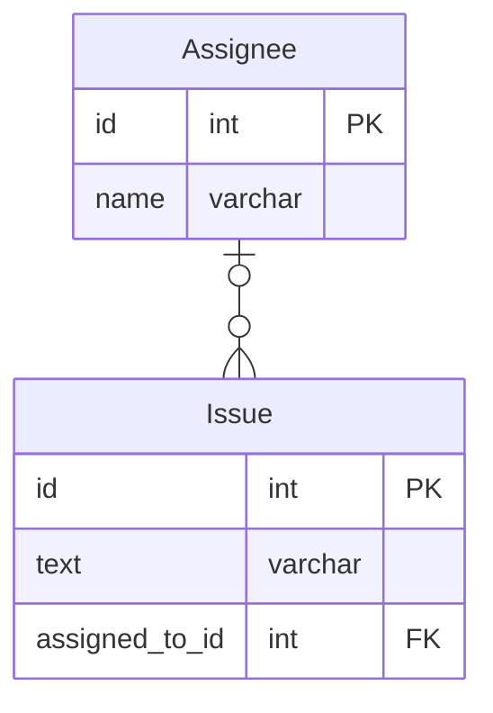

# 課題1
データベースにおけるnullは、等号（＝）、等号否定（！＝）、不等号（＜＞≦≧）で比較する対象にならない。
例えば、SELECT * FROM Users WHERE email = NULL;を実行しても、emailがNULLのレコードは返らない。
結果は0行になる。
データベースでNULLを条件にするには、IS NULL、IS NOT NULLという専用の命令句を使う。

SELECT NULL = 0;

NULL = NULL
NULL <> NULL
NULL AND TRUE
NULL AND FALSE
NULL OR TRUE
NULL IS NULL
NULL IS NOT NULL

# 課題2

# 課題3
BOOLEANならFALSE
INTなら0
TEXTなら''

# 課題4
NULLに関するクイズ