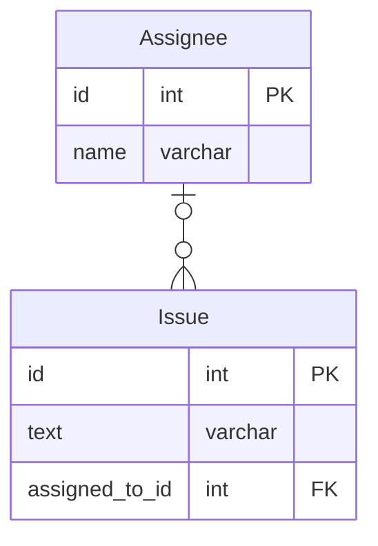
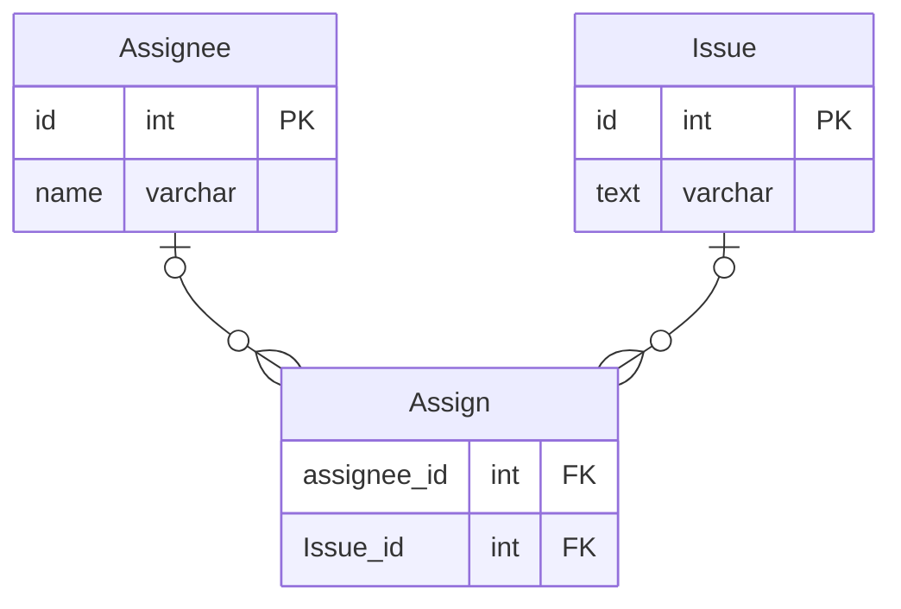

# 課題1
## データベースでNULLを比較するには
データベースにおけるNULLは、等号（＝）、等号否定（！＝）、不等号（＜＞≦≧）で比較する対象にならない。  
例えば、SELECT * FROM Users WHERE email = NULL;を実行しても、emailの値がNULLのレコードは返らない。  
結果は0行になる。  

そのため、データベースでNULLを条件にするには、IS NULL、IS NOT NULLという専用の命令句を使う必要がある。

## 3値論理とNULLについて
SQLの論理体系はtrue、false、unknownの3値論理と呼ばれている。  
プログラミング言語での真理値はtrueとfalseの2値論理なので、プログラミング言語とこの点が異なる。  
SQLが3値なのはNULLが原因であり、リレーショナルデータベースにNULLを持ち込んだため、unknownという3つめの値が必要になったという背景がある。  

データベースにおけるNULLは値がない状態であり、trueにもfalseにもなり得るという扱いで、unknownで表現する。  
NULL同士を比較してもtureにはならない。なぜならNULLはtrueにもfalseにもなり得るので、値が決まっていない以上比較のしようがないから。  

プログラミング言語でNULLの比較ができるのは、例えばC言語においてはNULLが定数として定義されているため。

参考：
https://codezine.jp/article/detail/532

## 各条件文の結果

SELECT NULL = 0;  
-- NULL（unknown）を0と比較できないため、結果は「NULL」（unknown）

NULL = NULL  
-- NULL（unknown）同士を比較できないため、結果は「NULL」（unknown）  
-- NULLは値が決まっていないので、NULL同士でも比較できない

NULL <> NULL  
-- NULL（unknown）同士を比較できないため、結果は「NULL」（unknown）

NULL AND TRUE  
-- NULLがTRUEなら、TRUE AND TRUEで真  
-- NULLがFALSEなら、FALSE AND TRUEで偽  
-- NULLの値により答えが変わるので、結果は「NULL」（unknown）

NULL AND FALSE  
-- NULLがTRUEなら、TRUE AND FALSEで偽  
-- NULLがFALSEなら、FALSE AND FALSEで偽  
-- NULLの値に関わらず答えはFALSEになるので、結果は「0」（FALSE）

NULL OR TRUE  
-- NULLがTRUEなら、TRUE OR TRUEで真  
-- NULLがFALSEなら、FALSE OR TRUEで真  
-- NULLの値に関わらず答えはTRUEになるので、結果は「1」（TRUE）

NULL IS NULL  
-- IS NULLならNULLを比較できるので、結果は「1」（TRUE）

NULL IS NOT NULL  
-- 結果は「0」（FALSE）

# 課題2
次のモデルでは、Issue.assigned_to_idがNULL許容である。
これを修正してIssueがNULLを含まないようにする。


方法1：Assignテーブルを作成する

Assignテーブルでアサイン状態を管理することで、
もしIssueにAssigneeがいなければレコードが存在しないだけなので、
NULLが発生することはない。

方法2：assigned_to_idにNOT NULL制約をつける。
```sql
alter table Issue alter column assigned_to_id int NOT NULL;
```


# 課題3
カラムごとに妥当なデフォルト値であれば問題ない。
そうでなくただNULLを避けるために適当な値を入れてしまうと、その値にも意味があるのでバグを引き起こす原因になる。
例えば、年齢を表すINTのカラムにNULLを入れたくないからと、0をデフォルトで設定したとする。すると未回答の人全てが0歳として登録されてしまい、誤ったデータを登録することになる。

データベースのNULLはunknownを意味するので、値が決まっていないのであればNULLを使用しても良いと考える。
ただし、以下のようなNULLによる問題があるので、できるなら使用を避けた方が良さそう。
- 課題1で見たように、カラムがNULLだと演算ができない
- カラムがNULLだとアプリケーション側で考慮が必要になる
- インデックスに影響？

あとは仕様上にNULLであってほしくないカラム（例：銀行の残高）はNULLを避けるべきだと思う。

# 課題4
## ソートするカラムにNULLが含まれていた場合、どのような並び順になるか
NULLは一番最後に出力される。

参考：
https://stackoverflow.com/questions/4336687/how-can-i-avoid-nulls-in-my-database-while-also-representing-missing-data