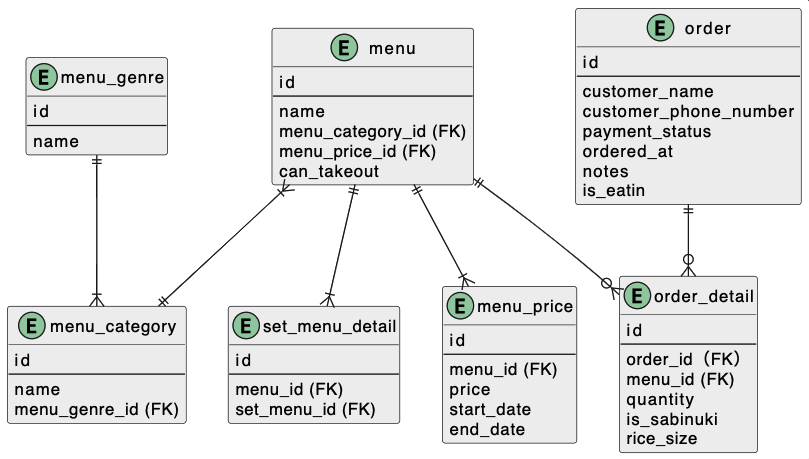

  
# 課題1

- menuテーブルにはえび、たまご、はな、わだつみなど単品もセットメニューも入る。セットメニューはset_menu_detailテーブルで含まれる単品メニューを検索できる。
- 各メニューは「盛り込み」「100円」などカテゴリに属する。カテゴリは「セットメニュー」「好み寿司」などジャンルに属する。
- 値段は変更時に過去の値が見られなくなると過去の売上集計した時に不整合起きると思うので履歴を持つことにした。  
  
# 課題2
- しゃりの大小をorder_detailテーブルのrice_sizeで数値で管理。1:大、2:中、3:小でデフォルトは2:中にする。
- 月の集計ができるようorderテーブルに注文日（ordered_at）を追加。order_detailとmenuテーブルを結合して寿司ネタが何個売れているか集計可能。
  
# 課題3
## 仕様変更の内容
同じメニューで、持ち帰りとは別に店内での注文の集計にも対応
  
- 持ち帰りか店内どっちの注文かを判別するため、orderテーブルにis_eatinカラムを追加し、これを条件に店内の集計を行う。trueなら店内、falseなら持ち帰りを表す。  