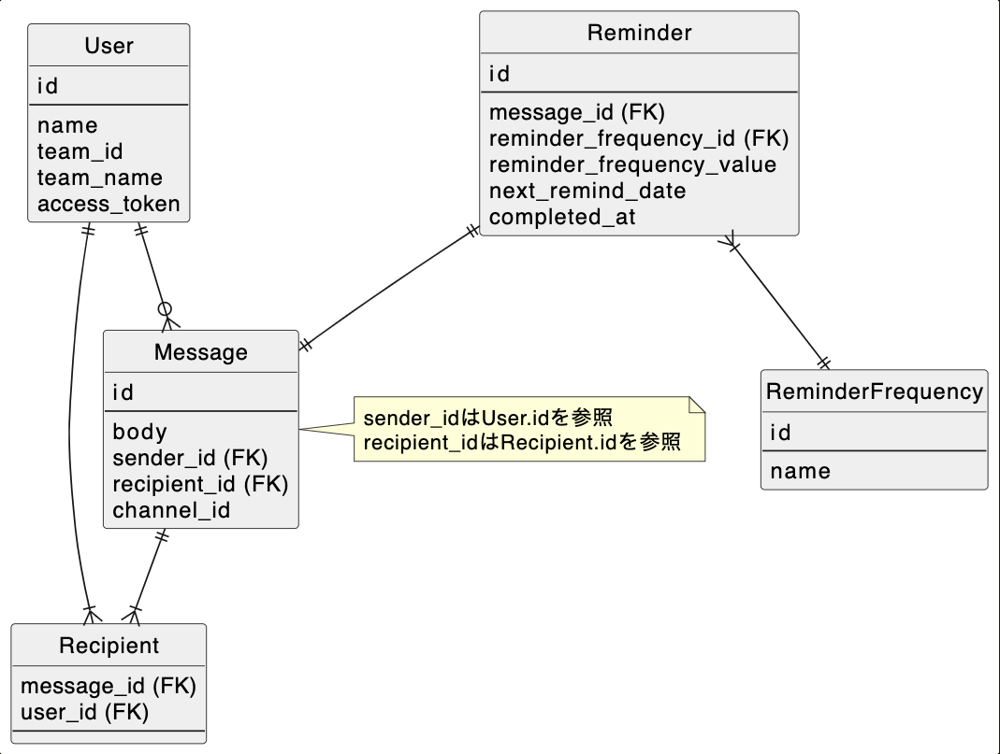

# 課題1
- リマインダーはReminderテーブルで管理
    - next_remind_timeには次にメッセージを送る時間をインターバルから計算して格納する。1時間ごとにバッチが動くので、動いた時点の時間＞＝next_remind_timeの時間で検索し、取得したデータのメッセージを送る。その際にnext_remind_timeを更新する。
    - reminder_frequency_idでは「X日おき」という情報を管理する。例えばevery dayなど
    - reminder_frequency_valueには「X日おき」の「X」が入る。例えば3など。reminder_frequency_idの情報と合わせると、every 3 dayなどのインターバルが表現できる 
- メッセージの送信者は複数になるので、Recipientテーブルで管理

## 懸念点
- MessageとReminderを分けるべきか？概念としては異なるので分けてみたが、一緒に出来る気もする
    - 一緒にした場合、テーブルが減り管理もクエリもシンプルになる
    - 別にした場合、責務が別れて後々手を加えやすい？
- 完了したタスクをslackメッセージから削除するにはtimestampが必要とのことだが、過去メッセージも削除できるようにするには過去メッセージのtimestampも保持する必要があると考える。その場合メッセージの履歴テーブルを作る必要がある