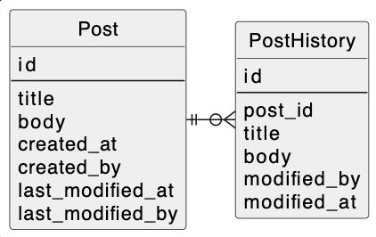
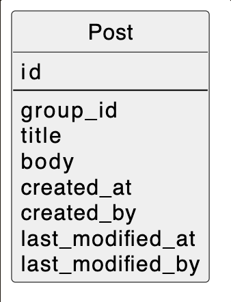

# 課題1
- 最新記事をPostテーブルで、過去の記事履歴をPostHistoryで管理
- 記事が更新された場合は、PostテーブルのデータをPostHistoryにインサートし、最新記事の情報でPostテーブルをアップデートする

# 課題2
- 分析のみの用途の場合、履歴データはDBに残す必要はないと考える
    - 理由：データ分析用のソフト（Tableau、Power BIなど）を利用すれば、ソフトに合わせてデータ抽出した後はDBにデータを残す必要がないため
- テーブルを一つにして設計
    - group_idには同一記事であることを示すidを入れる
    - 最新記事一覧を取得する場合は、group_idの中でlast_modified_at（更新日）が一番最近のものだけを抽出する
    - テーブルを一つにした時のメリットは、テーブルが少なくなること
    - デメリットは最新記事のidが更新ごとに変わるので、外部参照されていた場合、参照先も更新する必要がある
    - 余談：group_idではなくparent_idとして最初の記事のidを履歴に持たせる方法も考えたが、特定の記事の履歴一覧を取得する時に最初の記事のparent_idがnullとかなので単純にparent_idだけで検索できないのが引っかかった。
    最新から過去まで共通したidを持っている方がクエリがシンプルになりそうなのでgroup_idを採用。

