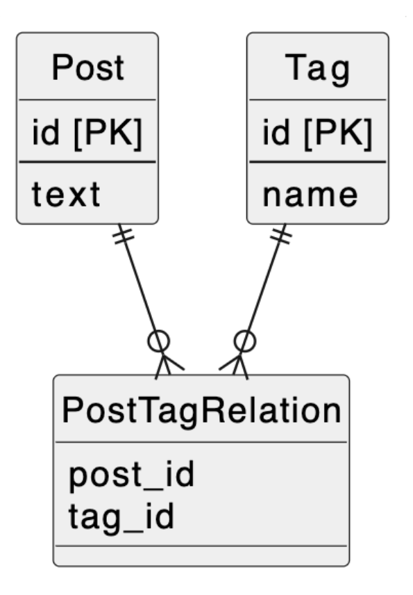

# 課題1
- タグが3つ以上増えた場合カラムの追加が必要になるので、メンテナンスコストが高い
- 使用していないタグカラムが存在する可能性があり、無駄が生まれる
- 取得するまでタグに値があるのかNULLなのか分からないので、結果を判定する余計な処理が増える

# 課題2
- 交差テーブルを作成する

# 課題3
- 交流サイトを開発していると仮定する
    - 当初はプロフィールの趣味を1つ登録できたが、途中から10個登録できるように仕様変更したので、趣味idカラムを10に増やしてアンチパターンに陥った