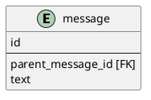
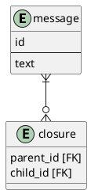
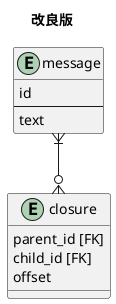
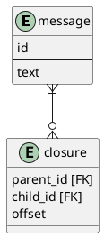

# 課題1
- ツリー構造をリレーショナルデータベースで表現する
## 方法1 ナイーブツリー

- この課題のように自己参照する設計
### メリット
- 親を参照するだけなのでシンプル、テーブルが少ない
- 挿入が簡単
    - ノードを追加して、もし子ノードがある場合はそれらの親idを変更するだけ。対象は子ノードの一階層のみなので検索も簡単
- 更新が簡単
    - 更新するノードの親idを変更するだけ
### デメリット
- ツリー全体、あるノード配下などの取得
    - 各ノードが親ノードしか知らないため、複数階層を取得するにはその階層分だけjoinが必要になる
    - 子ノードが存在する限り自動でjoinするSQLは書けない
- あるノード配下を削除
    - 親のid外部参照しているので、あるノードを削除するとその子ノードの外部参照が制約違反になる
    - 一度子ノードまで検索し、子ノードから順に削除する必要がある
- ノード単体を削除
    - 削除するノードの子ノードの親idをあらかじめ更新してから、削除が必要
## 方法2 閉包テーブル

- 閉包（closure）テーブルを作成し、このテーブルでツリーの親子関係をすべて保持する
- 直接の親子だけでなく、祖先との関係も保持するため、ナイーブツリーのデメリットを解消できる
## メリット
- ツリー全体、あるノード配下などの取得
    - 起点のノードのidを指定してclosureテーブルを検索すれば、単純なクエリで検索できる
    - ツリーの深さでSQLが変わることもない
- あるノード配下を削除
    - 削除するノードのidを指定してclosureテーブルから削除すれば良い
- ノード単体を削除
    - 削除するノードのidを指定してclosureテーブルから削除すれば良い
## デメリット
- 挿入
    - 挿入する位置の祖先をすべて取得してから、祖先の数だけレコード挿入が必要
- ツリー構造のまま取得できない
    - 例えばあるノード配下をすべて取得した場合、起点のノードに紐づく子ノード一覧が取れるが、それぞれの子ノードがどの階層にいるかの情報はない。そのため一つの取得クエリだけでツリー構造が作れない。これに対応するには、closureテーブルにoffsetのようなカラムを作り、親要素からどれくらい離れているかを保持する情報も一緒に取得する

# 課題2
- 閉包テーブルを作成する
    - すべての親子関係を閉包テーブルで管理することで、上記の問題を解決する。
    

- SQLはquery.sqlを参照

# 課題3
- ツリー構造の組織図をリレーショナルデータベースで表現する場合。組織テーブルですべての組織を管理し、parentカラムで親にあたる組織のidを保持するよう設計し、アンチパターンに陥る。
