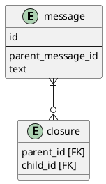

# 課題1
- レコードセレクトが大変
    - 取得したい階層分だけ自身のテーブルを結合する必要があるのでクエリが複雑になる
- レコード削除が大変
    - 削除レコード配下のレコードのparent_message_idを更新しなければならない
    - parent_message_idに外部キー制約が付いているため、単純には削除できない

# 課題2
- 閉包テーブルを作成する
    - すべての親子関係を閉包テーブルで管理することで、上記の問題を解決する。
    

- SQLはquery.sqlを参照

# 課題3
- ツリー構造の組織図をリレーショナルデータベースで表現する場合。組織テーブルですべての組織を管理し、parentカラムで親にあたる組織のidを保持するよう設計し、アンチパターンに陥る。
