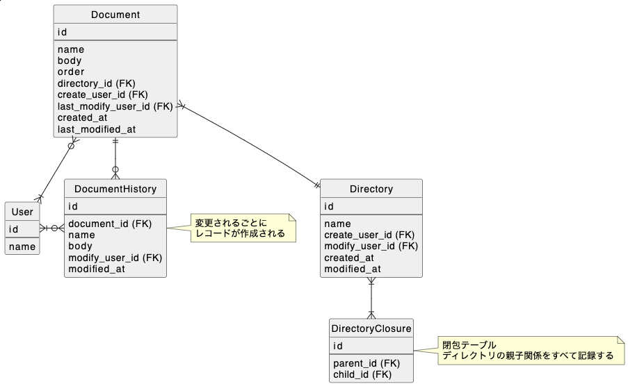

# 課題1
- ドキュメントは最新の内容をDocumentで管理、過去の変更はDocumentHistoryで管理する
- 変更ごとにDocumentHistoryにレコード追加するためデータ量が増える点が懸念点。恐らく変更点のみ差分保存すれば良いと思うがそのメカニズムが分からない

# 課題2
- ドキュメントのソート順をDirectoryで保存し、データ取得時はまずその値を参照し、クエリのソート順だけ動的に変更して取得する
- ソート順はSortOrderがマスタテーブルで、Directoryが外部キーsort_order_idを持つ