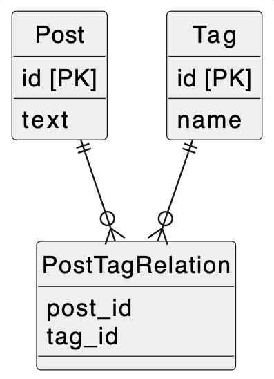

# 課題1
- 特定のタグを持つ投稿を一覧表示する時
    - すべてPostのtagsをlikeなどで検索しなくてはならず、コストが高くなる
- タグの名前を変更したい場合
    - 変更するタグを含むPostを探し、それらすべてを更新する必要がある
- タグ詳細など、各タグに情報を持たせる仕様変更があった場合
    - 各タグが値として格納されているので、情報を持たせることができない

### 参考
https://stackoverflow.com/questions/3653462/is-storing-a-delimited-list-in-a-database-column-really-that-bad

### メモ　なぜ複数の値を一つのカラムに入れてはいけないのか
- 第一正規形（一つのセルには一つの値しか含まない）を破るから
    - 第一正規形を破ると主キーで各列の値を一意に決定できない
    - 今回は一つの投稿に複数のタグが紐付いているので、どちらにせよPKで一意に決定できない
- 複数の値が重複してしまうことのほうが問題
    - 表記ブレや、更新漏れなどが起こる
- タグを概念としてではなく単なる値として扱っているので、タグを主役にして操作する時（例えばtagAを含む投稿を取得するなど）にコストがかかる（Likeを使ったり、プログラムで文字列からタグを検出しなければならない）

# 課題2

- タグを管理するテーブルTagを作成することで、課題1の問題を解決
- 投稿とタグは多対多の関係なので、交差テーブル（PostTagRelation）を作成

# 課題3

- メールやメッセージアプリの送信者
    - 複数の人に送信できる場合に、「"Aさん", "Bさん", "Cさん"」のように入力する送信者カラムを作ってしまい、アンチパターンに陥る
