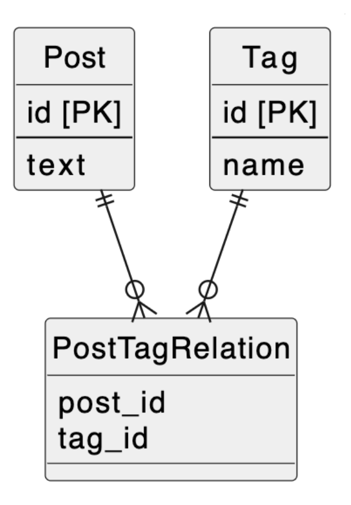

# 課題1
- タグが3つ以上増えた場合カラムの追加が必要になるので、メンテナンスコストが高い
- 使用していないタグカラムが存在するので、不要なカラムが存在してしまう
- 使用していないタグカラムが存在するので、タグをすべて検索する時に無駄な検索が行われる
- 取得結果を見ないとタグに値があるかNULLか分からないので結果を判定する余計な処理が増える

# 課題2
- 交差テーブルを作成する

# 課題3
- 交流サイトを開発していると仮定する
    - 当初はプロフィールの趣味を3つまで登録できたが、途中から10個登録できるように仕様変更したので、趣味idカラムを10に増やしてアンチパターンに陥った