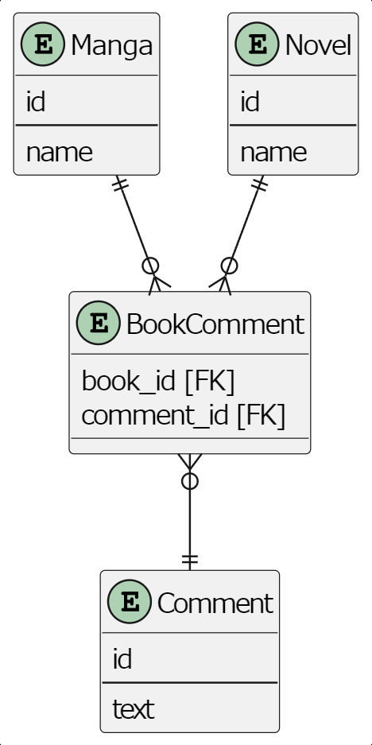

# 課題1
- belongs_to_idとtypeの整合性が合わないデータが存在できる(belongs_to_idは漫画のidだがtypeが小説など)
- 自分のコメント一覧などコメントから本を検索するときに、typeを見て結合するテーブルを決めなければならず、処理が複雑になる
- belongs_to_idの参照先が2つのテーブルに分かれているので、このカラムに外部キー制約が使えなくなる

# 課題2
- 本とコメントの関係を保持する中間テーブルを用意する

# 課題3
- レビューサイトで、最初は音楽アルバムだけのレビューを扱っていたが、途中から映画や劇などもレビューするようになった。
その変更に対応するため、Reviewテーブルにtypeとbelongs_to_idを追加してこのアンチパターンに陥る