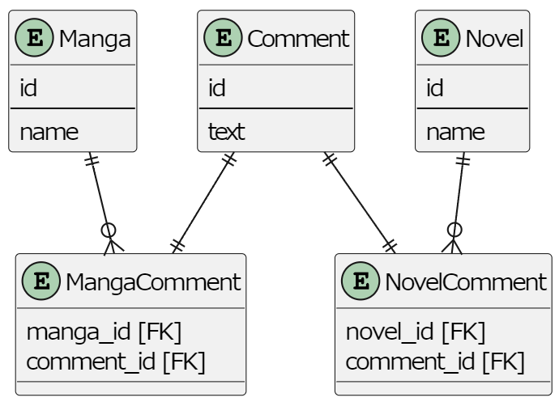

# 課題1
- belongs_to_idとtypeの整合性が合わないデータが存在できる(belongs_to_idは漫画のidだがtypeが小説など)
- 自分のコメント一覧などコメントから本を検索するときに、typeを見て結合するテーブルを決めなければならず、処理が複雑になる
- belongs_to_idの参照先が2つのテーブルに分かれているので、このカラムに外部キー制約が使えなくなる

# 課題2
- 本とコメントの関係を保持する中間テーブルを用意する
    - 中間テーブルの各idの参照先が一つのテーブルになるように、MangaCommentとNovelCommentという2つのテーブルを作成

## SQL
-- 漫画一覧と各コメントを取得
SELECT 
 manga.id,
 manga.name,
 comment.text
FROM manga 
LEFT JOIN manga_comment
on manga.id = manga_comment.manga_id
LEFT JOIN comment
on manga_comment.comment_id = comment.id;

-- # id, name, text
-- '1', 'HUNTER HUNTER', 'It\'s the best'
-- '2', 'JOJO', 'It\'s okay'
-- '2', 'JOJO', 'I want beer'
-- '3', 'NARUTO', NULL

-- 小説をすべて検索
select * from novel;

-- # id, name
-- '1', 'Harry Potter'
-- '2', 'Mujuryoku Piero'
-- '3', 'The Lord of the Rings'

# 課題3
- レビューサイトで、最初は音楽アルバムだけのレビューを扱っていたが、途中から映画や劇などもレビューするようになった。
その変更に対応するため、Reviewテーブルにtypeとbelongs_to_idを追加してこのアンチパターンに陥る
