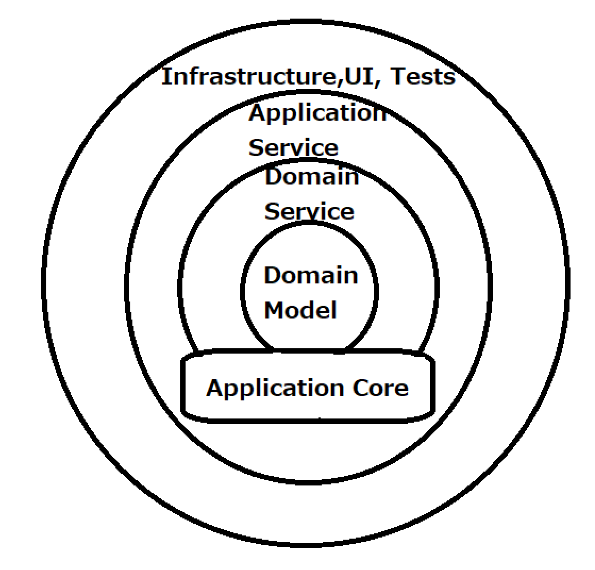

# 課題1
## オニオンアーキテクチャの図解

- ドメインモデル
エンテティ、バリューオブジェクトなど
- ドメインサービス
DomainService、IRepositoryなど
- アプリケーションサービス
ApplicationService、IUserSessionなど
- インフラ、UI、テスト
File Access, DB Access, ORMなど

## ドメインモデルがどの層にも依存しないことのメリット
- インフラやアプリケーション層の変更が影響しない
## 層をまたいで依存関係が発生する場合にインターフェースに対する依存のみ許可していることのメリット
- インターフェースを挟むことで層同士の結合度を緩くすることで、変更があった場合に他の層への影響を少なくすることができる
## 依存性の逆転がオニオンアーキテクチャにどのように使われているか
- 外から内側へ依存する性質を実現するためそれぞれの層で依存性の逆転が使われている
## アクセス機能の実装はどこに記述する？
- ドメインサービス
    - アプリケーション層に記載すると
## データベースを変更するときはどの層を変更する？
- インフラ層
    - DBアクセスはインフラ層に含まれるため

# 課題2
- Q1: オニオンアーキテクチャのメリットはなんでしょうか？
- Q2: オニオンアーキテクチャのデメリットはなんでしょうか？
- Q3: アプリケーションサービスとドメインサービスに記述するものの違いはなんでしょうか？

# 疑問点
- アプリケーションサービス層とドメインサービス層の違いが分からない
    - [DDD journey: what's the difference between domain and application services?](http://aleron75.com/2021/04/08/ddd-journey-difference-domain-application-services/)
    - この記事によると、アプリケーションはユーザーから見えるユースケースを書くらしい（本を注文する、本のリストを取得するなど）
        - 具体的にはcontrollerなど
    - ドメインサービスはユーザーには見えない細かい処理を書くらしい（注文の合計金額の計算など）
- オニオンアーキテクチャの利点としてビジネスロジックとインフラ層の依存を少なくできることが挙げられているが、それは従来のレイヤーアーキテクチャ＋依存性の逆転をすれば実現できるのでは？
    - [Is there really such a thing as the onion architecture?](https://softwareengineering.stackexchange.com/questions/366010/is-there-really-such-a-thing-as-the-onion-architecture)